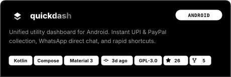
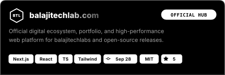
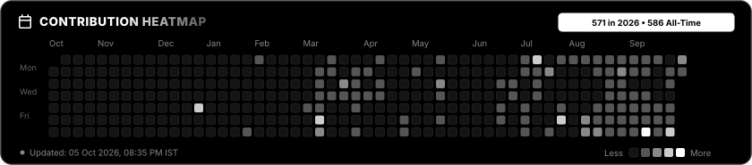

<!-- markdownlint-disable MD033 MD041 -->
<table border="0" style="border: none; width: 100%; border-collapse: collapse;">
<tr style="border: none; background: transparent;">
<td width="65%" valign="top" style="border: none; padding-right: 14px;">

<table border="1" cellpadding="6" style="border-collapse: collapse; margin-bottom: 12px;">
<tr>
<td align="center" width="42"></td>
<td align="center" width="42"></td>
<td align="center" width="42"></td>
<td align="center" width="42"></td>
<td align="center" width="42"></td>
<td align="center" width="42"></td>
<td align="center" width="42"></td>
<td align="center" width="42"></td>
<td align="center" width="42"></td>
</tr>
</table>

<table border="1" cellpadding="6" style="border-collapse: collapse; margin-bottom: 12px;">
<tr>
<td align="center" width="42"></td>
<td align="center" width="42"></td>
</tr>
</table>

<table border="1" cellpadding="6" style="border-collapse: collapse; margin-bottom: 14px;">
<tr>
<td align="center" width="42"></td>
<td align="center" width="42"></td>
</tr>
</table>

<table border="1" cellpadding="6" style="border-collapse: collapse;">
<tr>
<td align="center" width="44"></td>
<td align="center" width="44"></td>
<td align="center" width="44"></td>
<td align="center" width="44"></td>
<td align="center" width="44"></td>
<td align="center" width="44"></td>
</tr>
<tr>
<td align="center" width="44"></td>
<td align="center" width="44"></td>
<td align="center" width="44"></td>
<td align="center" width="44"></td>
<td align="center" width="44"></td>
<td align="center" width="44"></td>
</tr>
<tr>
<td align="center" width="44"></td>
<td align="center" width="44"></td>
<td align="center" width="44"></td>
<td align="center" width="44"></td>
<td align="center" width="44"></td>
<td align="center" width="44"></td>
</tr>
</table>
</td>
<td width="35%" align="center" valign="top" style="border: none; padding-left: 14px;">

</td>
</tr>
</table>

<table border="0" style="border: none; width: 100%; border-collapse: collapse;">
<tr style="border: none; background: transparent;">
<td width="50%" valign="top" style="border: none; padding-right: 6px;">

<table border="0" cellpadding="0" cellspacing="0" style="width: 100%; border-collapse: collapse; margin: 0; padding: 0;">
<tr>
<td width="33.3%" align="center" style="border: none; padding: 0; margin: 0;">

</td>
<td width="33.4%" align="center" style="border: none; padding: 0; margin: 0;">

</td>
<td width="33.3%" align="center" style="border: none; padding: 0; margin: 0;">

</td>
</tr>
</table>
</td>
<td width="50%" valign="top" style="border: none; padding-left: 6px;">

<table border="0" cellpadding="0" cellspacing="0" style="width: 100%; border-collapse: collapse; margin: 0; padding: 0;">
<tr>
<td width="50%" align="center" style="border: none; padding: 0; margin: 0;">

</td>
<td width="50%" align="center" style="border: none; padding: 0; margin: 0;">

</td>
</tr>
</table>
</td>
</tr>
</table>

&nbsp;&nbsp;

<picture>
  <source media="(prefers-color-scheme: dark)" srcset="https://raw.githubusercontent.com/Balajitechlabs/balajitechlabs/output/github-contribution-grid-snake-dark.svg" />
  <source media="(prefers-color-scheme: light)" srcset="https://raw.githubusercontent.com/Balajitechlabs/balajitechlabs/output/github-contribution-grid-snake.svg" />
  
</picture>

